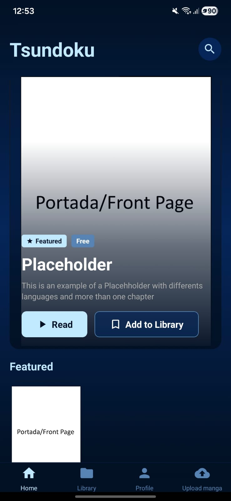
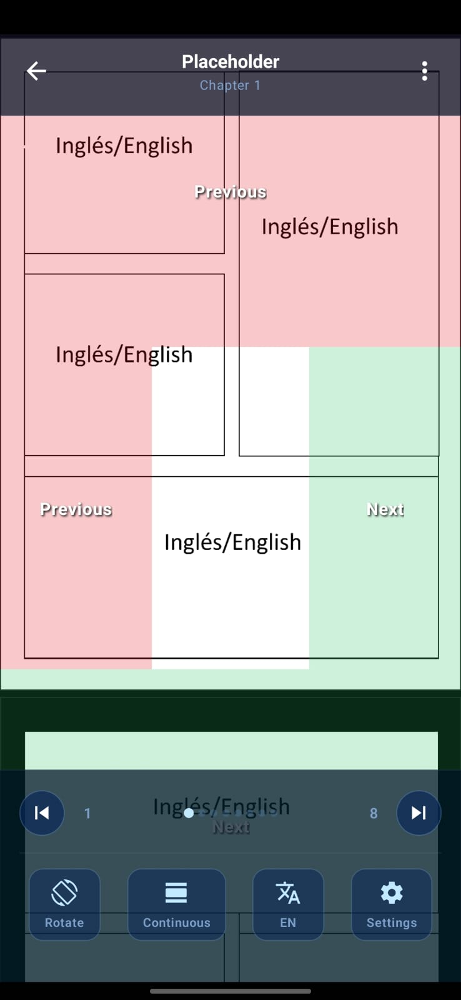
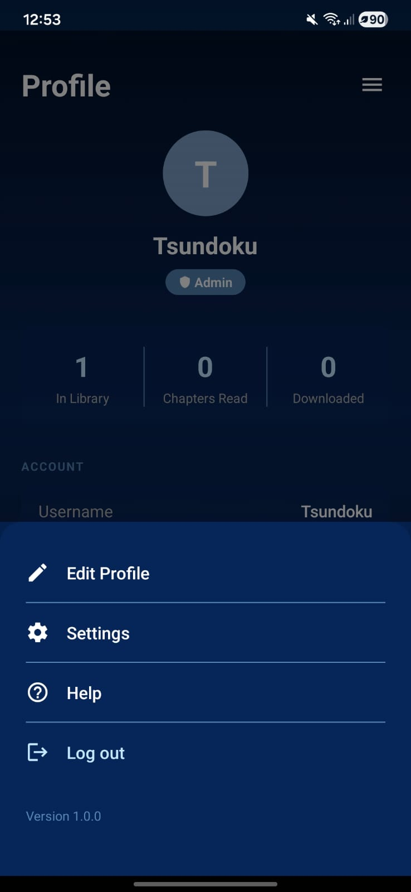

# 📚 Tsundoku

  A modern mobile reader for manga, manhwa, manhua, and comics.

  
  
  
  
  

---

## 🔗 Full Preview

  👉 <a href="https://mateoorodaz.vercel.app"><b>View screenshots & demo video</b></a>

---

## 📱 Demo APK

  👉 <a href="../../releases"><b>Download Latest Demo</b></a>

  <i>Version v0.4.0 · Android · Demo Build</i>

---

## ✨ Features

* 📚 Personal library with continue reading
* 📖 Advanced reader (LTR, RTL, continuous scroll)
* 🌐 Multi-language support (EN, ES, JA, KO)
* 🔐 Authentication (login & register)
* ⭐ Featured content system
* 📤 Upload system for series & chapters (admin)
* ☁️ Cloud sync via Supabase

---

## 📸 Screenshots

  
  
  

---

## 🚧 Project Status

  Active development — features and stability are continuously improving.

---

## ⚠️ Disclaimer

  This repository is a <b>public showcase</b>. 
  The source code is kept private.

---

## 🛠️ Tech Stack

  Expo · React Native · TypeScript · Supabase

---

## 📬 Contact

  Feel free to reach out for feedback, collaboration, or opportunities.

